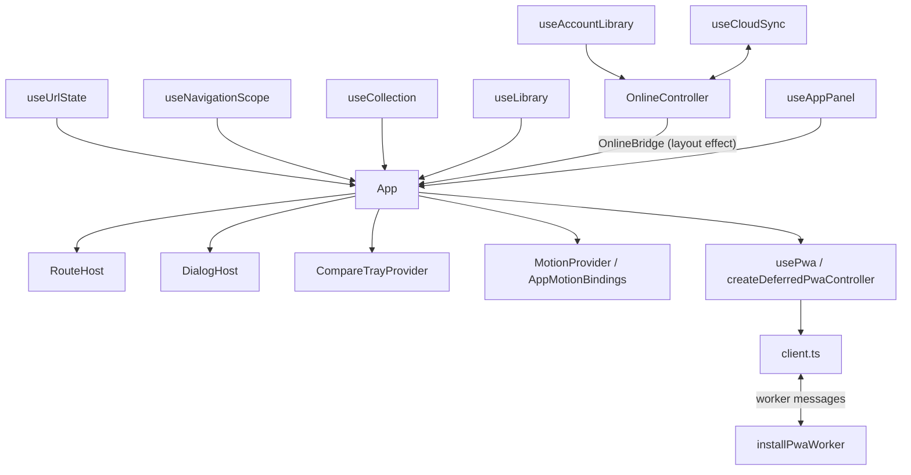

# Runtime architecture

## Composition root

[App](../src/App.tsx) selects the active library and connects navigation, panels,
previews and account state. It composes `MotionProvider`, `AppMotionBindings`,
`CompareTrayProvider` and `LibraryModeContext` around the page and dialog hosts.
[RouteHost](../src/components/app/RouteHost.tsx) selects page content and loads
the online controller lazily. [DialogHost](../src/components/app/DialogHost.tsx)
renders the selected detail or utility dialog without owning its saved data.
Before the first commit, a built `index.html` may show the static
[first-paint shell](first-paint-shell.md) of the landing page in `#root`;
`createRoot()` replaces it, and no app code reads it. The shell's inline boot
script loads the app entry, after the shell's first paint on the landing page.
[main.tsx](../src/main.tsx) renders the app as a transition, so React renders the
first commit in time slices; that commit is the same, because only its effects
apply the guest library and collection results.

## Sources of truth

[useUrlState](../src/hooks/useUrlState.ts) reads pathname and search through an
external-store subscription. History and the URL determine the page, public
filters, My games tab, numeric Library `page` and selected detail. Library
page changes create history entries; Back, Forward and reload restore the
bounded 25-game page. Refinements reset it and removals clamp it with replace,
without putting the private Library search text or saved opinions in the URL.
Opening a detail records whether closing it should use native Back or replace
a directly entered detail URL. Detail Previous/Next and workspace view changes
flush pending editors first; rejected edits keep their original field mounted
and return focus to it. Scope or navigation changes cancel a pending handoff.

Ranking also mounts at most 25 rows. Its page and search are lightweight,
scope-local workspace state, independent of the Library URL page. Global rank
numbers, boundary move arrows and within-page keyboard/drag sorting preserve
the full ranking order. Explicit numeric moves use the additive in-memory
`move-item` / `ranking` / `position` action: guest and account transactions
resolve the slot against their current ranking, reject positions outside
`1..ranking.length`, and fix the chosen slot (including the current position).
Persisted record, library and cloud formats do not change.

Clean Ranking panes unmount after a guarded tab exit. Rejected edits retain
only their bounded page, including after browser Back. A non-empty manual
title/year also retains its form and bounded Ranking subtree, even if its
picker is collapsed, so existing module-recovery and PWA reload guards can
still detect the mounted unsubmitted form. Paging flushes registered editors
before replacing rows; a dirty note keeps its row mounted even when a saved
score changes its global rank.

[useLibrary](../src/hooks/useLibrary.ts) owns the guest library snapshot and
serializes writes through the device database. Storage failure is explicit:
temporary edits stay in the tab rather than claiming a durable save. The opened
library is published as a transition.
[useAccountLibrary](../src/hooks/useAccountLibrary.ts) reads and writes a separate
account scope through [scoped-library](../src/lib/scoped-library.ts).
App keeps the guest hook mounted and selects the account controller when present;
it does not copy one library into the other when switching the active view.

Public collection metadata comes from [useCollection](../src/hooks/useCollection.ts),
which renders the ready collection as a transition.
Unsaved previews are bounded, scope-qualified metadata in App, not library imports.
[PreviewAuthority](../src/lib/preview-authority.ts) supplies a revocable subscription
for shared previews; it does not persist records.
[CompareTrayProvider](../src/components/compare-tray/CompareTrayProvider.tsx)
owns a separate scoped pin store backed by localStorage, not the library queue.
Panel state belongs to [useAppPanel](../src/hooks/useAppPanel.ts); notification,
manual-share and offline-settings state are separate from the selected URL detail.

## Boundaries

[OnlineController](../src/cloud/OnlineController.tsx) combines account state and
[useCloudSync](../src/cloud/useCloudSync.ts), then publishes an `OnlineBridge`
to App in a layout effect. The bridge carries the protected controller, scope,
identity and status. App blocks library actions while account resolution is pending.
Sync work has a lifetime tied to account ownership, verification and consent.
Security policy and release procedures are defined in [Security](security.md)
and the [security release runbook](security-release-runbook.md).

[usePwa](../src/pwa/usePwa.ts) subscribes to `createDeferredPwaController` in
[deferred-controller](../src/pwa/deferred-controller.ts). Menu or Settings intent
can request the client connection. [installPwaWorker](../src/pwa/worker.ts) owns
the service-worker cache lifecycle, not guest or account library writes.

[AppMotionBindings](../src/AppMotionBindings.tsx) connects preview origin leases
and route arrival to the motion runtime. App updates scope and URL motion
generations during render, so stale origins are not accepted while waiting for
passive history effects. Native dialog close and focus restoration do not wait
for animation completion.

## Event flow

Guarded link navigation, account entry and comparison launch flush registered
edits through [useExitSave](../src/hooks/useExitSave.ts), then recheck currentness
before committing their transition. [useNavigationScope](../src/hooks/useNavigationScope.ts)
tracks scope and navigation generations; selected flows also compare the actual URL.
Account entry retains a failed field as its focus target instead of opening sign-in.
PWA update preparation flushes edits and rejects unsubmitted forms. Its reload
guard also checks the current Settings panel, busy state and new input events.

## Invariants and coverage

| Invariant | Coverage |
| --- | --- |
| Remembered account opening does not expose an editable guest fallback. | [Online restoration](../tests-cloud-ui/online.spec.ts) |
| Guest and account storage remain separate. | [Scoped library](../src/lib/scoped-library.test.ts), [account continuity](../tests-cloud-ui/continuity.spec.ts) |
| Old scope or navigation work cannot become current again after a roundtrip. | [Navigation guards](../src/hooks/useNavigationScope.test.ts) |
| Preview authority is revocable and does not own persistence. | [Preview authority](../src/lib/preview-authority.test.ts) |
| Late panel imports do not reopen a cancelled request. | [Panel lifecycle](../src/hooks/useAppPanel.browser.test.ts) |
| Terminal module failures offer guarded reload rather than repeated cached imports. | [Chunk recovery](../tests/chunk-recovery.spec.ts) |
| Sign-in handoff preserves current focus and does not steal it after navigation. | [Compare return focus](../tests/compare-return-focus.spec.ts) |
| Native dialog input and close remain independent of motion completion. | [Dialog lifecycle](../src/motion/Dialog.browser.test.ts) |
| PWA connection and update work respect cleanup and currentness guards. | [Deferred controller](../src/pwa/deferred-controller.test.ts), [client lifecycle](../src/pwa/client.test.ts) |
| Typing during an update defers its reload; a later request reloads. | [Update input guard](../src/pwa/update-guard.browser.test.ts) |

The controller tests exercise supplied update guards. The mounted guard test runs
the App's input-generation hook and `createPwaUpdateGuard` through the real
`executePwaUpdate` reload path against a scripted controller; it does not mount
the App root or a real service worker. See the
[implementation map](../README.md#implementation-map) for the wider source layout.

## Changing these boundaries

Preserve effect order, stable ref identity, scope keys and subscription cleanup,
including StrictMode reconnects. Keep native history and focus behavior explicit.
Fill the relevant mounted coverage gap before extracting a lifecycle, change one
boundary at a time, and preserve lazy imports rather than widening the eager graph.
