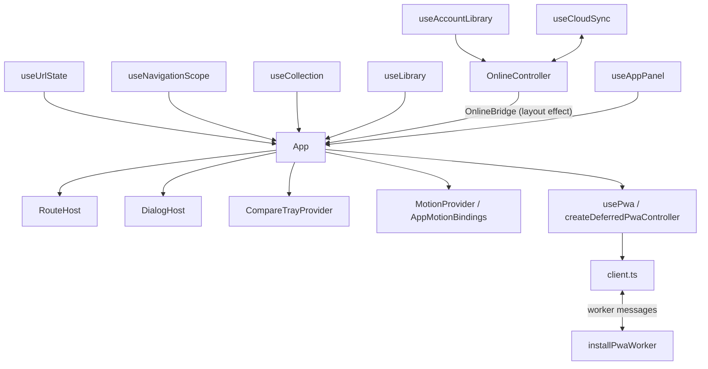

# Runtime architecture

## Composition root

[App](../src/App.tsx) selects the active library and connects navigation, panels,
previews and account state. It composes `MotionProvider`, `AppMotionBindings`,
`CompareTrayProvider` and `LibraryModeContext` around the page and dialog hosts.
[RouteHost](../src/components/app/RouteHost.tsx) selects page content and loads
the online controller lazily. [DialogHost](../src/components/app/DialogHost.tsx)
renders the selected detail or utility dialog without owning its saved data.
Before the first commit, a built `index.html` may show the static
[first-paint shell](first-paint-shell.md) of the landing page in `#root`;
`createRoot()` replaces it, and no app code reads it. The shell's inline boot
script loads the app entry, after the shell's first paint on the landing page.
If the entry does not load or throws, the boot script shows the failure notice
`#root` also holds instead. [main.tsx](../src/main.tsx) marks `<html>` with
`data-app-started` as its last statement, which keeps the notice hidden. It
renders the app as a transition, so React renders the first commit in time
slices; that commit is the same, because only its effects apply the guest
library and collection results.

## Sources of truth

[useUrlState](../src/hooks/useUrlState.ts) reads pathname and search through an
external-store subscription. History and the URL determine the page, public
filters, My games tab, numeric Library `page` and selected detail. Library
page changes create history entries; Back, Forward and reload restore the
bounded 25-game page. Refinements reset it and removals clamp it with replace,
without putting the private Library search text or saved opinions in the URL.
When Library is embedded outside a My games route, its bounded pager keeps
local page state instead of rewriting the host URL; save guards, clamping,
results focus and committed range motion use the same path.
Opening a detail records whether closing it should use native Back or replace
a directly entered detail URL. Detail Previous/Next and workspace view changes
flush pending editors first; rejected edits keep their original field mounted
and return focus to it. Scope or navigation changes cancel a pending handoff.

Ranking also mounts at most 25 rows. Its page and search are lightweight,
scope-local workspace state, independent of the Library URL page. Global rank
numbers, boundary move arrows and within-page keyboard/drag sorting preserve
the full ranking order. Explicit numeric moves use the additive in-memory
`move-item` / `ranking` / `position` action: guest and account transactions
resolve the slot against their current ranking, reject positions outside
`1..ranking.length`, and fix the chosen slot (including the current position).
Persisted record, library and cloud formats do not change.

Clean Ranking panes unmount after a guarded tab exit. Rejected edits retain
only their bounded page, including after browser Back. A non-empty manual
title/year also retains its form and bounded Ranking subtree, even if its
picker is collapsed, so existing module-recovery and PWA reload guards can
still detect the mounted unsubmitted form. Paging flushes registered editors
before replacing rows; a dirty note keeps its row mounted even when a saved
score changes its global rank.

[useLibrary](../src/hooks/useLibrary.ts) owns the guest library snapshot and
serializes writes through the device database. Storage failure is explicit:
temporary edits stay in the tab rather than claiming a durable save. The opened
library is published as a transition.
[useAccountLibrary](../src/hooks/useAccountLibrary.ts) reads and writes a separate
account scope through [scoped-library](../src/lib/scoped-library.ts).
App keeps the guest hook mounted and selects the account controller when present;
it does not copy one library into the other when switching the active view.

Public collection metadata comes from [useCollection](../src/hooks/useCollection.ts),
which renders the ready collection as a transition.
Unsaved previews are bounded, scope-qualified metadata in App, not library imports.
[PreviewAuthority](../src/lib/preview-authority.ts) supplies a revocable subscription
for shared previews; it does not persist records.
[CompareTrayProvider](../src/components/compare-tray/CompareTrayProvider.tsx)
owns a separate scoped pin store backed by localStorage, not the library queue.
Panel state belongs to [useAppPanel](../src/hooks/useAppPanel.ts); notification,
manual-share and offline-settings state are separate from the selected URL detail.

## Storage failures

Guest library writes and backup replacement commit atomically in IndexedDB.
A quota-refused transaction does not publish a successful library mutation:
the previous records, progress, ranking, notes and revision remain readable
after reload. The storage warning is
“Device storage is full. Your changes were not saved. Free some space and try again.”
This does not promise that unsaved tab state survives a user-requested reload,
site-data clearing or browser eviction; downloaded backups remain independent
recovery copies.

A failed import keeps its pending preview and Settings dialog open, with
“Restore failed. Your existing library was not replaced.” Retrying that preview
after freeing space can commit it, clear the failure and report
“Your backup was restored and saved on this device.” Reloading before retry
requires selecting the backup file again; it must not replace the old library.

Manual entry is an inline native `details` form, not a dialog. A refused or
rejected Save reports “The game could not be added. Your entry is unchanged;
try again.” It keeps the open disclosure, title and optional year, without
reloading or treating the attempted game as saved. Successful retry clears
only the submitted draft and persists the new record.

The Chromium production-partition campaign
[`tests/storage-quota.spec.ts`](../tests/storage-quota.spec.ts) measures
`navigator.storage.estimate().usage`, applies an origin-specific CDP
`Storage.overrideQuotaForOrigin` limit, and exercises real IndexedDB and
CacheStorage failures rather than mocking their write methods. It runs only
in fresh loopback profiles and always lifts the override and detaches CDP in
`finally`. The [PWA storage contract](pwa.md#storage-failures) covers the
independent offline cache. Test source is not evidence that a particular
release ran the campaign.

## Boundaries

[OnlineController](../src/cloud/OnlineController.tsx) combines account state and
[useCloudSync](../src/cloud/useCloudSync.ts), then publishes an `OnlineBridge`
to App in a layout effect. The bridge carries the protected controller, scope,
identity and status. App blocks library actions while account resolution is pending.
Sync work has a lifetime tied to account ownership, verification and consent.
Security policy and release procedures are defined in [Security](security.md)
and the [security release runbook](security-release-runbook.md).

The internal [account-deletion](../src/cloud/account-deletion.ts) unit owns
deletion approval expiry, scope-qualified cleanup probes and the ordered
reauthentication/reservation/cleanup/Auth-deletion operation. Its pure selectors
keep approval ownership, saving epochs, auth-session generations and completed
cleanup receipts distinct. The controller passes its existing stores and callbacks;
approval-expiry and probe hooks stay at their original positions relative to
identity reset, Google-return handling and member subscriptions. No page body,
UI text or backend authorization policy is owned by this unit.

The [account-session](../src/cloud/account-session.ts) unit owns the Google-return
and initial-session handshake, the restoration deadline and persisted-page
listener, and once-only return consumption. Pure return transitions distinguish
an incomplete or foreign return, cache-waiting reauthentication, changed saving
epochs, successful sign-in/link and a fresh deletion approval. The bootstrap
observer delegates identity reconciliation to its supplied owner; it does not
create a second auth observer, clear libraries or perform deletion on return.
The controller invokes bootstrap and return handling at their original effect
positions, leaving the existing navigation and pending-edit contract intact.

The [account-identity](../src/cloud/account-identity.ts) lifetime owns token-read
coalescing, verification-mismatch refresh suppression and auth-session epochs.
Only the exact pending read may clear its slot; a foreign UID cannot publish
identity or update the remembered-session hint. Token refresh for the same UID
keeps its epoch, while account changes and sign-out advance it and clear the
previous comparison scope. The controller still passes that stable epoch holder
to sync/sharing/deletion and leaves successful-token UID gating and observer
error lifetime gating unchanged. Member/profile snapshots and page rendering
remain composition concerns, not state inside the token reconciler.

These three units are static dependencies only of the already-lazy online graph.
They add no eager entry import, new route root, stylesheet, storage format or
server rule. Their new deterministic unit suites supplement the unchanged
identity, Google redirect, private-deletion and cloud-UI regressions; the refactor
does not claim a new runtime pass until the integrator runs them.

Online page bodies are separate dynamic imports, not static dependencies of that
identity/sync bridge. Remembering an account on The 100 may load the bridge and
Firebase, but does not request Account, Community, public profile, publication,
creator, Friends, invitation, comparison or selected-sharing page code.
The creature picker and sign-in form load only when rendered. The selected-shelf
editor and friend-facing shelf cards are separate modules so reading a friend's
games does not pull in the owner's editor.

[OnlinePageBoundary](../src/cloud/OnlinePageBoundary.tsx) reuses
`createRetryableModule`, `ChunkBoundary`, `Suspense`, `RouteFallback` and
`ChunkRecovery`; it does not introduce a second import/reload protocol.
Its identity includes the account scope, auth-session generation, page and the
page's target (public handle, friend, comparison group or invitation). Private
save revisions do not remount forms. A page-module failure leaves the controller
and its `OnlineBridge` mounted; changing pages or account scope clears only the
failed page boundary. Native sign-in and picker dialogs keep their own closeable,
scope-bound loading/recovery states. Existing navigation flush, account-transition
and sync lifecycles remain in their original owners.

[usePwa](../src/pwa/usePwa.ts) subscribes to `createDeferredPwaController` in
[deferred-controller](../src/pwa/deferred-controller.ts). Menu or Settings intent
can request the client connection. [installPwaWorker](../src/pwa/worker.ts) owns
the service-worker cache lifecycle, not guest or account library writes.

[AppMotionBindings](../src/AppMotionBindings.tsx) connects preview origin leases
and route arrival to the motion runtime. App updates scope and URL motion
generations during render, so stale origins are not accepted while waiting for
passive history effects. Native dialog close and focus restoration do not wait
for animation completion.

## Event flow

Guarded link navigation, account entry and comparison launch flush registered
edits through [useExitSave](../src/hooks/useExitSave.ts), then recheck currentness
before committing their transition. [useNavigationScope](../src/hooks/useNavigationScope.ts)
tracks scope and navigation generations; selected flows also compare the actual URL.
Account entry retains a failed field as its focus target instead of opening sign-in.
PWA update preparation flushes edits and rejects unsubmitted forms. Its reload
guard also checks the current Settings panel, busy state and new input events.

## Invariants and coverage

| Invariant | Coverage |
| --- | --- |
| Remembered account opening does not expose an editable guest fallback. | [Online restoration](../tests-cloud-ui/online.spec.ts) |
| Guest and account storage remain separate. | [Scoped library](../src/lib/scoped-library.test.ts), [account continuity](../tests-cloud-ui/continuity.spec.ts) |
| Old scope or navigation work cannot become current again after a roundtrip. | [Navigation guards](../src/hooks/useNavigationScope.test.ts) |
| Preview authority is revocable and does not own persistence. | [Preview authority](../src/lib/preview-authority.test.ts) |
| Late panel imports do not reopen a cancelled request. | [Panel lifecycle](../src/hooks/useAppPanel.browser.test.ts) |
| Terminal module failures offer guarded reload rather than repeated cached imports. | [Chunk recovery](../tests/chunk-recovery.spec.ts) |
| Remembered-session restore does not request online page bodies; route/picker failures preserve the bridge and saved libraries. | [Online page loading](../tests-cloud-ui/online-page-loading.spec.ts), [built module graph](../tests/app-tool-loading.spec.ts) |
| Sign-in handoff preserves current focus and does not steal it after navigation. | [Compare return focus](../tests/compare-return-focus.spec.ts) |
| Native dialog input and close remain independent of motion completion. | [Dialog lifecycle](../src/motion/Dialog.browser.test.ts) |
| PWA connection and update work respect cleanup and currentness guards. | [Deferred controller](../src/pwa/deferred-controller.test.ts), [client lifecycle](../src/pwa/client.test.ts) |
| Typing during an update defers its reload; a later request reloads. | [Update input guard](../src/pwa/update-guard.browser.test.ts) |

The controller tests exercise supplied update guards. The mounted guard test runs
the App's input-generation hook and `createPwaUpdateGuard` through the real
`executePwaUpdate` reload path against a scripted controller; it does not mount
the App root or a real service worker. See the
[implementation map](../README.md#implementation-map) for the wider source layout.

## Changing these boundaries

Preserve effect order, stable ref identity, scope keys and subscription cleanup,
including StrictMode reconnects. Keep native history and focus behavior explicit.
Fill the relevant mounted coverage gap before extracting a lifecycle, change one
boundary at a time, and preserve lazy imports rather than widening the eager graph.

### Measuring the online split

Measure the production build with `npm run check:budgets -- --json budget-report.json`
after running the guarded-loading regressions. The largest remaining lazy chunk
may be a shared Firebase/sync dependency rather than a page; report that filename
and both raw and per-file gzip9 maxima, not just `OnlineController`'s own bytes.
For R9, the integrator tightens `budgets.json` only after measuring that build:
`largestLazyRawBytes = min(1115037, ceil(measuredLargestLazyRawBytes * 1.02))` and
`largestLazyGzipBytes = min(286846, ceil(measuredLargestLazyGzipBytes * 1.02))`.
Both should be strictly smaller than the prior caps; otherwise investigate the
emitted graph instead of raising a limit or claiming the reduction. Keep the
historical baseline and all eager/CSS/PWA caps unchanged, and record the measured
source/tree with the tightened caps. These formulas are an integration instruction,
not a fabricated size receipt; lane implementation and new tests are **UNRUN**
until the integrator executes them.

### Route costs

`npm run check:budgets` also measures what each lazily loaded page or picker
root costs to open. The roots are `ROUTE_ROOTS` in
[check-budgets.ts](../scripts/check-budgets.ts): every `React.lazy()` in `src`,
which a unit test derives from the source. For each one it sums the gzip9 bytes,
per file, of the root chunk, the chunks it imports statically (transitively) and
the stylesheets those chunks import, leaving out files already in the eager set,
from the retained Vite manifest. It prints a row per route, gates the most
expensive as `largestRouteGzipBytes`, and `--json` lists every route with its
files. A root that the build does not emit as a dynamic entry, or an import that
the manifest cannot resolve, fails the check. A row is the cost of opening that
root when nothing else lazy has loaded. An online page also needs the online
bridge (`src/cloud/OnlineController.tsx`), which has its own row.
