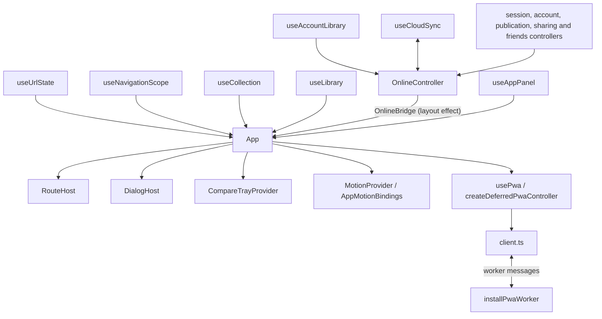

# Runtime architecture

## Composition root

[App](../src/App.tsx) selects the active library and connects navigation, panels,
previews and account state. It composes `MotionProvider`, `AppMotionBindings`,
`CompareTrayProvider` and `LibraryModeContext` around the page and dialog hosts.
[RouteHost](../src/components/app/RouteHost.tsx) selects page content and loads
the online controller lazily. [DialogHost](../src/components/app/DialogHost.tsx)
renders the selected detail or utility dialog without owning its saved data.
Collection search publishes its current matches to a shell-local value store,
not shell state. Only a mounted canonical detail subscribes, selecting the
current query's records; typing and background matches do not repaint the
header, footer or mobile navigation. The existing result order, aliases,
private progress filters and pending-edit navigation guards remain unchanged.
A dialog render failure unmounts only that dialog, clears its open request and
restores a usable focus target. A keyed dialog boundary reports the existing
`dialog` error category and leaves the shell, other dialogs and saved libraries
available. The existing guarded reload control explains recovery outside the
closed dialog; opening another dialog or changing scope does not inherit its
failed render state. Module-load failures retain their specific recovery UI.
A known catalog preview uses a native, cancellable loading dialog while its
detail module loads, without mounting private editors. Close or Escape clears
the selection; late module completion cannot reopen the dismissed detail.
Before the first commit, a built `index.html` may show the static
[first-paint shell](first-paint-shell.md) of the landing page in `#root`;
`createRoot()` replaces it, and no app code reads it. The shell's inline boot
script loads the app entry, after the shell's first paint on the landing page.
If the entry or its stylesheet does not load, or the entry throws, the boot
script shows the failure notice `#root` also holds instead.
[main.tsx](../src/main.tsx) marks `<html>` with
`data-app-started` as its last statement, which keeps the notice hidden. It
renders the app as a transition, so React renders the first commit in time
slices; that commit is the same, because only its effects apply the guest
library and collection results.

## Sources of truth

[useUrlState](../src/hooks/useUrlState.ts) reads pathname and search through an
external-store subscription. History and the URL determine the page, public
filters, My games tab, numeric Library `page` and selected detail. Library
page changes create history entries; Back, Forward and reload restore the
bounded 25-game page. Refinements reset it and removals clamp it with replace,
without putting the private Library search text or saved opinions in the URL.
When Library is embedded outside a My games route, its bounded pager keeps
local page state instead of rewriting the host URL; save guards, clamping,
results focus and committed range motion use the same path.
Opening a detail records whether closing it should use native Back or replace
a directly entered detail URL. Detail Previous/Next, the Your rank shortcuts in
both detail families and workspace view changes flush pending editors first;
rejected edits keep their original field mounted and return focus to it.
Scope or navigation changes cancel a pending handoff.

Discover keeps its URL updates, pending-edit guards, selection, results and
requested-page focus in `DiscoverPage`. `DiscoverControls` contains the search
and filter controls and the online-source controls; both render their existing
elements directly, without new layout wrappers. They receive the same change
callback, filter IDs and search-edit ref from the page. Neither owns a second
copy of URL state, remounts result editors nor adds a shared or lazy entry point.

[routes.ts](../src/lib/routes.ts) is the one list of pages served from
`index.html`. The router (`pageFromPath`), the offline worker's shell and
not-found checks, and the client error reports' route templates all read it;
`scripts/pwa-build.ts` bundles it into the self-contained `sw.js`. `vercel.json`
cannot import it, so [routes.test.ts](../src/lib/routes.test.ts) fails when its
`index.html` rewrites and the list differ. A new page is added there first.

App's commands are stable (`useStableHandlers`), so children that receive them
do not re-render, except those that can write a library: perform, restore,
reset, or a command that calls one. Those are named in `LibraryCommand` and
bound with `useBoundHandlers` to the library they were rendered with. An editor
that saves while another tab signs out or switches account then writes to the
account it was opened for, not to whichever library is current when it runs.
A new command that can reach a library writer goes in `LibraryCommand`.
[app-command-binding.test.ts](../src/app-command-binding.test.ts) type-checks
App and fails if a stable command can reach one, and
[AppDetailSave.browser.test.ts](../src/components/app/AppDetailSave.browser.test.ts)
holds a catalog-detail rating in the real App across a cross-tab sign-out.

Ranking also mounts at most 25 rows. Its page and search are lightweight,
scope-local workspace state, independent of the Library URL page. Global rank
numbers, boundary move arrows and within-page keyboard/drag sorting preserve
the full ranking order. Explicit numeric moves use the additive in-memory
`move-item` / `ranking` / `position` action: guest and account transactions
resolve the slot against their current ranking, reject positions outside
`1..ranking.length`, and fix the chosen slot (including the current position).
Persisted record, library and cloud formats do not change.

Clean Ranking panes unmount after a guarded tab exit. Rejected edits retain
only their bounded page, including after browser Back. A non-empty manual
title/year also retains its form and bounded Ranking subtree, even if its
picker is collapsed, so existing module-recovery and PWA reload guards can
still detect the mounted unsubmitted form. Paging flushes registered editors
before replacing rows; a dirty note keeps its row mounted even when a saved
score changes its global rank.

My games consistently labels its queue **Play later**, including page counts,
navigation and action notices; adding a record is instead **Add to My games**.
Reorder arrows use guarded `aria-disabled` while saving and at list edges, keeping
native focus intact. After a saved move, focus follows the same row's arrow,
including across page boundaries, or its opposite arrow at an edge. A deliberate
focus change while saving is not overridden. Numeric moves keep their input or
Move button visible after saving or refusal; across pages, the moved record's
Move to position summary receives focus. Drag moves retain title focus when
they cross pages.
Mobile rows group Rank and delete with the move controls and omit the redundant
progress summary; Played and Completed remain individually labeled controls.
Compact comparison buttons expose **Pin** on coarse pointers.

Frequent card, detail, table and personal-row actions keep native focus during
pending writes with guarded `aria-disabled`. Ranking notes and position inputs
become read-only rather than disabled; clearing a bulk selection moves focus to
Select all. A row's tray handle uses the stack symbol, distinct from its reorder
grip. The rating-order action stays mounted after releasing its fixed position.
Action notices use optional, non-persisted transaction feedback: guest and account
commits compare the reducer-validated previous state to the result before writing
the receipt after commit. Counts exclude duplicate IDs and already-set values,
and single progress notices name the game and direction. Failed writes never
populate a success receipt; existing boolean controller results remain unchanged.

The personal page bodies delegate paging and guarded commands to
[useLibraryPage](../src/components/personal/useLibraryPage.ts) and
[useRankingsPage](../src/components/personal/useRankingsPage.ts). Record and ranking
rows remain ordinary subcomponents with the same DOM and editor identities.
Bounded retained rows and mounted tab panes belong to React state, so discarded renders
do not overwrite the committed editor page. Latest callback inputs and navigation
generations update at commit; focus recovery consumes each request once without
an extra state-clearing render. The Library cursor preserves a requested reset
until its URL replacement commits, while still accepting Back and Forward.

[useLibrary](../src/hooks/useLibrary.ts) owns the guest library snapshot and
serializes writes through the device database. Storage failure is explicit:
temporary edits stay in the tab rather than claiming a durable save. The opened
library is published as a transition.
[useAccountLibrary](../src/hooks/useAccountLibrary.ts) reads and writes a separate
account scope through [scoped-library](../src/lib/scoped-library.ts).
Ordinary account edits validate the envelope, then let the personal reducer
validate and copy the active state once. Its trusted result is not parsed again;
updated sync counters still pass metadata validation before any write. Stored
recovery copies and restored or remote replacements retain full validation.
State, dirty markers and both friend-removal journals still share one transaction.
The dense account-edit unit benchmark reports three before/after samples using
10,000 synthetic records in fake IndexedDB; timing is diagnostic, not a pass gate.
Account writers capture the device copy's generation when it opens. Removal
retires that generation under `account-writer:v1:<scope>` in the same transaction
that removes its library, recovery and sharing caches. This small marker contains
only a generation and retirement flag, not games or profile data, and survives
removal so delayed writers in other tabs cannot recreate the copy. Every scoped
mutation checks it before updating state, sync metadata or removal journals.
Only `openScopedLibrary` for a fresh account-opening lifetime can reactivate the
scope; focus, broadcast refresh, retries and captured saves cannot. Old cache
envelopes without a generation belong to generation zero. Scope-only legacy
mutation calls remain pinned to zero rather than inheriting a later generation.
Ordinary sign-out does not retire writers, so pending edits can still settle in
their original account without being redirected to the guest. `perform`, restore
and reset bindings remain stable for one generation and change together when its
opening lifetime changes or retirement is observed.
App keeps the guest hook mounted and selects the account controller when present;
it does not copy one library into the other when switching the active view.

Public collection metadata comes from [useCollection](../src/hooks/useCollection.ts),
which renders the ready collection as a transition.
The visible saved additions in Beyond The 100 dynamically import the existing
catalog module from an effect only when a saved provider row needs artwork. It shares the
same exact-ID presence check and bounded catalog transport as My games, even
with a blank search or online lookup disabled. There is no static hook import
from the additions list, so its artwork code stays outside the eager graph.
The bundled catalog is loaded only for records with known local artwork; manual
and known no-art records do not cause a metadata fetch. Artwork completion
updates only the additions, not AppShell's search state or saved library data.
Unmount or a changed row set cancels only that caller, retaining shared loads
for other views. A failed module or catalog load leaves the rows and editors
mounted with the existing guarded reload control. The catalog module is already
an offline core root and is checked by the deferred-module build guard, so this
adds no new public chunk solely for artwork.
The existing `app-shared` group includes the entry's static closure, rather
than compressing already-eager modules as separate files. Dynamic catalog,
route and scene imports stay separate and the eager-module guard checks that
boundary. This reduces transfer bytes and offline file count without changing
which features load on demand.
Unsaved previews are bounded, scope-qualified metadata in App, not library imports.
[PreviewAuthority](../src/lib/preview-authority.ts) supplies a revocable subscription
for shared previews; it does not persist records.
[CompareTrayProvider](../src/components/compare-tray/CompareTrayProvider.tsx)
owns a separate scoped pin store backed by localStorage, not the library queue.
Settings reset clears that active scope's Compare pins after its library reset
commits. A failed library reset leaves pins intact, and an old completion cannot
clear a newer account binding. If the saved tray cannot be removed, Settings
reports the partial reset instead of claiming all device data was cleared.
Its binding becomes active in a layout effect and is revoked during cleanup:
constructing an abandoned replacement does not invalidate the displayed tray.
Neither binding construction nor an inactive binding can read or write storage.
Grip readiness renders from the current interaction prop through a separate
context; the mutable controller still checks committed ownership when an event
runs. Rendering does not query the previous commit's controller readiness.
Panel state belongs to [useAppPanel](../src/hooks/useAppPanel.ts); notification,
manual-share and offline-settings state are separate from the selected URL detail.
The manual share fallback is named **Copy this link**. It owns the document
title while open, ahead of an underlying detail or panel; closing restores
that prior title through the existing title helper without changing history.
Visible toast surfaces pass pointer input through to the page except at their
actual buttons and links. Dismissal and nested recovery actions remain interactive;
the existing live-region announcements, focus handling and timeout are unchanged.
Played and Completed remain focusable during pending saves, using `aria-disabled`
and guarded activation instead of native disabling. Completing a save does not
move focus to the document body or permit repeated writes while it is pending.

## Storage failures

Guest library writes and backup replacement commit atomically in IndexedDB.
A quota-refused transaction does not publish a successful library mutation:
the previous records, progress, ranking, notes and revision remain readable
after reload. The storage warning is
“Device storage is full. Your changes were not saved. Free some space and try again.”
This does not promise that unsaved tab state survives a user-requested reload,
site-data clearing or browser eviction; downloaded backups remain independent
recovery copies.

A failed backup replacement keeps its pending preview and Settings dialog open, with
“Restore failed. Your existing library was not replaced.” Retrying that preview
after freeing space can commit it, clear the failure and report
“Your backup was restored and saved on this device.” Reloading before retry
requires selecting the backup file again; it must not replace the old library.
Restore and Cancel import stay focusable while a write is pending and ignore
repeat activation. Successful replacement and cancellation return focus to the
Import backup trigger after the preview disappears. Failed replacement keeps
the preview and its focused action. A closed or superseded Settings dialog
never takes focus back when an old replacement finishes.
The export filename uses the device's local calendar date, including near
midnight and year boundaries. The backup's `exportedAt` remains an ISO UTC
timestamp; the schema and saved library content are unchanged.

Import feedback distinguishes unreadable JSON/files from unsupported backup
formats or versions and points to Export my library for a compatible file.
Size-limit refusals keep their existing wording; stored-library validation and
recovery diagnostics are not rewritten.

Manual entry is an inline native `details` form, not a dialog. A refused or
rejected Save reports “The game could not be added. Your entry is unchanged;
try again.” It keeps the open disclosure, title and optional year, without
reloading or treating the attempted game as saved. Successful retry clears
only the submitted draft and persists the new record.

The Chromium production-partition campaign
[`tests/storage-quota.spec.ts`](../tests/storage-quota.spec.ts) measures
`navigator.storage.estimate().usage`, applies an origin-specific CDP
`Storage.overrideQuotaForOrigin` limit, and exercises real IndexedDB and
CacheStorage failures rather than mocking their write methods. It runs only
in fresh loopback profiles and always lifts the override and detaches CDP in
`finally`. The [PWA storage contract](pwa.md#storage-failures) covers the
independent offline cache. Test source is not evidence that a particular
release ran the campaign.

## Boundaries

Account's page remains one lazy route, with local form and confirmation state in
[useAccountPage](../src/cloud/useAccountPage.ts). Its header and deletion notices
stay in [AccountPage](../src/cloud/AccountPage.tsx); the connection, sync and
backup controls live in [AccountLibrarySection](../src/cloud/AccountLibrarySection.tsx),
the profile/sharing controls in [AccountSidebar](../src/cloud/AccountSidebar.tsx),
and the existing native dialog in [AccountConfirmation](../src/cloud/AccountConfirmation.tsx).
These components do not create account, sync or deletion lifetimes: they use
the same supplied callbacks and the page-owned state, with unchanged field IDs,
classes, accessible names and text.

[OnlineController](../src/cloud/OnlineController.tsx) composes the online
controllers, then publishes an `OnlineBridge` to App in a layout effect;
[online-bridge](../src/cloud/online-bridge.ts) builds it. The bridge carries the
protected controller, scope, identity and status. App blocks library actions
while account resolution is pending. The controllers are hooks, which the
controller calls in this order:

- [useOnlineSession](../src/cloud/useOnlineSession.ts) is the identity/session
  controller: the identity lifetime and session observer, sign-in by Google or
  email, verification and password reset, the Compare tray's sign-in
  continuation, the invitation this tab has open, and the runner every online
  action reports through, with its busy flag and messages.
- [useOnlineAccount](../src/cloud/useOnlineAccount.ts) holds the account's
  device copy and private online saving through
  [useCloudSync](../src/cloud/useCloudSync.ts), the initial restoration, the
  member, profile, head and creator records Account previews with their refresh
  and member watch, and the registration and deletion state.
- `useGoogleReturn` (in useOnlineSession.ts) applies this page load's Google
  return, then expires a deletion approval it grants.
- [useOnlinePublication](../src/cloud/useOnlinePublication.ts) holds the
  creature, the name, the header's public identity and what publishing opens.
- [useOnlineSharing](../src/cloud/useOnlineSharing.tsx) holds automatic and
  selected sharing with friends, with the automatic-sharing summary.
- [useOnlineFriends](../src/cloud/useOnlineFriends.ts) holds the identity
  friends see, opening Compare and its route, and the shared-games list's
  preparation.
- [useAccountActions](../src/cloud/useAccountActions.ts) connects, pauses,
  links Google, signs out, exports, cleans up and chooses copies, and builds the
  context Account's deletion runs in.

[OnlinePages](../src/cloud/OnlinePages.tsx) renders the online page App routed
to. Each controller resets its own state in the render that sees a new account,
so the new account's first render shows none of the previous one's records,
messages or dialogs. The controllers write latest-value refs in layout effects,
and render reads none of them.

Sync work has a lifetime tied to account ownership, verification and consent.
The lifetime's state changes only through its own methods, from effects,
callbacks and handlers. A new lifetime's status, messages and known head reset
in the render that creates it, and work from an earlier lifetime stops owning
anything once the new one commits.
Security policy and release procedures are defined in [Security](security.md)
and the [security release runbook](security-release-runbook.md).

The internal [account-deletion](../src/cloud/account-deletion.ts) unit owns
deletion approval expiry and scope-qualified cleanup probes, and
[account-deletion-action](../src/cloud/account-deletion-action.ts) owns the
ordered reauthentication/reservation/cleanup/Auth-deletion operation, which only
Account runs and which therefore loads with that page. Its pure selectors
keep approval ownership, saving epochs, auth-session generations and completed
cleanup receipts distinct. The controller passes its existing stores and callbacks
as the operation's context;
the deletion probe runs before the member subscription, and approval expiry
runs right after the Google-return transition that can grant an approval. No
page body, UI text or backend authorization policy is owned by this unit.

The [account-session](../src/cloud/account-session.ts) unit owns the Google-return
and initial-session handshake, the restoration deadline and persisted-page
listener, and once-only return consumption. Pure return transitions distinguish
an incomplete or foreign return, cache-waiting reauthentication, changed saving
epochs, successful sign-in/link and a fresh deletion approval. The bootstrap
observer delegates identity reconciliation to its supplied owner; it does not
create a second auth observer, clear libraries or perform deletion on return.
The session controller starts the bootstrap observer after the identity
lifetime attaches, and takes a return's Compare flag as the return arrives.
useGoogleReturn applies the return once its account and device copy are ready.
The existing navigation and pending-edit contract is unchanged.

The [account-identity](../src/cloud/account-identity.ts) lifetime owns token-read
coalescing, verification-mismatch refresh suppression and auth-session epochs.
Only the exact pending read may clear its slot; a foreign UID cannot publish
identity or update the remembered-session hint. Neither can a read that outlives
its controller: when restoration gives up and the controller unmounts (even
before its session observer first hears from Firebase), the same account stays
signed in and the user may choose this device, so a late successful read still
settles for its callers but publishes nothing and leaves the online choice as it
is. An email sign-in that finishes after that controller unmounted remembers
nothing either. The check runs when the read completes, so a controller that
StrictMode or Fast Refresh mounts again still publishes it. Token refresh for
the same UID keeps its epoch, while account changes and sign-out advance it and
clear the previous comparison scope. The controller still passes that stable
epoch holder to sync/sharing/deletion. Successful reads are gated on the UID and
the mounted controller, and observer errors on the observer's lifetime. The
lifetime tracks that mount itself: `attach`, from the controller's passive
effect that runs just before the session observer's, marks it mounted, so no
render writes it.
Member/profile snapshots and page rendering remain composition concerns, not
state inside the token reconciler.

These three units are static dependencies only of the already-lazy online graph.
They add no eager entry import, new route root, stylesheet, storage format or
server rule. Their new deterministic unit suites supplement the unchanged
identity, Google redirect, private-deletion and cloud-UI regressions; the refactor
does not claim a new runtime pass until the integrator runs them.

Online page bodies are separate dynamic imports, not static dependencies of that
identity/sync bridge. Remembering an account on The 100 may load the bridge and
Firebase, but does not request Account, Community, public profile, publication,
creator, Friends, invitation, comparison or selected-sharing page code.
The creature picker and sign-in form load only when rendered. The selected-shelf
editor and friend-facing shelf cards are separate modules so reading a friend's
games does not pull in the owner's editor.

[FriendStore](../src/cloud/friend-store.ts) keeps its methods, names and
exports. Its operations live in modules it delegates to on the same instance:
friend-store-core (shared checks), friend-profile, friend-pairs,
friend-invites, friend-ranking-share, friend-groups and friend-cleanup. A test
that patches its prototype still intercepts every call. FriendsPage's dialogs,
relation rows, invite and blocked lists and controls are components
(FriendsPageDialogs, FriendRelationList, FriendInvitesAndBlocks,
FriendsPageControls), and its URL-backed view, comparison selection, relation
feed, invite and blocked pages, invitation clock and invite dialog are hooks
(friends-page-view, friends-page-selection, friends-page-data,
friends-page-invite). None is imported by another route, so they load with
their route.

[OnlinePageBoundary](../src/cloud/OnlinePageBoundary.tsx) reuses
`createMemoizedModule`, `ChunkBoundary`, `Suspense`, `RouteFallback` and
`ChunkRecovery`; it does not introduce a second import/reload protocol.
The module helper retains a rejected import until reload, rather than retrying it.
Its identity includes the account scope, auth-session generation, page and the
page's target (public handle, friend, comparison group or invitation). The
generation is state, which the account-identity lifetime sets in the same call
that publishes each new session's identity, so a render never sees one without
the other. Handlers and work that settles later compare against the live epoch,
`authSessionEpochRef`, which no render reads. The
controller reads the URL for these targets through
[online-location](../src/cloud/online-location.ts), a subscription to
`popstate` and `play100:navigate`, not by reading `location` during render, so
a navigation renders it again even when App does not. For Compare, the target
is the opening a navigation made: a navigation that changes the group the URL
names opens Compare afresh. The page changes `?group=` in place when the user
picks, saves or clears a group and reports that change, so the next navigation
compares with the page's own group and does not remount the page or drop its
unsaved group name and selection. Both are recorded at once, outside render, in
the controller's Compare route, which renders read through a subscription, so
no render at any priority can see the page's new URL before the route knows it
is the page's own. Private save revisions do not remount forms. A page-module
failure leaves the controller
and its `OnlineBridge` mounted; changing pages or account scope clears only the
failed page boundary. Native sign-in and picker dialogs keep their own closeable,
scope-bound loading/recovery states. Existing navigation flush, account-transition
and sync lifecycles remain in their original owners.

[usePwa](../src/pwa/usePwa.ts) subscribes to `createDeferredPwaController` in
[deferred-controller](../src/pwa/deferred-controller.ts). Menu or Settings intent
can request the client connection. [installPwaWorker](../src/pwa/worker.ts) owns
the service-worker cache lifecycle, not guest or account library writes.

[AppMotionBindings](../src/AppMotionBindings.tsx) connects preview origin leases
and route arrival to the motion runtime. App updates scope and URL motion
generations during render, so stale origins are not accepted while waiting for
passive history effects. Native dialog close and focus restoration do not wait
for animation completion.
The motion runtime captures only public return geometry during dialog layout
cleanup, before the provider commits its next snapshot. Return authorization
waits until native close, when the committed route, scope and origin guards are
checked again; capturing geometry alone cannot authorize a return flight.

## Event flow

Collection-only table, additional-result and film implementations share the
guarded `CollectionExtras` entry. The default grid does not import those
implementations. Table hover, focus or pointer-down preloads the entry; a table
deep link requests it directly. Films request it within 800px of their section,
after collection metadata settles. Additional results mount only for an
eligible search or matching saved additions, so mounting requests their tools
immediately rather than waiting for proximity. A no-query landing with no
additional matches retains deferred film loading.
Fallback Search online stays operable outside the inert cards. Focusing it
requests the chunk and transfers focus to the real control; activation latches
one action for the same query and runs it after loading, moving focus to the
persistent results heading. A changed query or unmount discards that intent,
and loading never steals focus from another control. Fallbacks
retain the same table content/frame and film listing copy/16:9 frames; loading
table/result-card controls are inert, while a film Watch request is retained until
the player can open. Unmount prevents a late import from publishing stale UI.
The eager parent permanently owns the film section/heading and the
additional-results labelled section/heading. Only their bodies swap from
fallbacks to loaded UI, so fragment targets and focused headings do not detach
during an import. The table has no linked ID; its existing outer deferred
container and reserved frame remain mounted.
Terminal import failures retain a local guarded-reload action rather than
clearing the collection or retrying cached failed imports.

Rolldown's default chunking retains the existing intent entry paths and offline
roots. No manual group rewrites their manifest identities. The build guard
rejects eager inclusion of the deferred collection implementations, and all
moved views remain in the explicit PWA core. No budget is raised; the actual
emitted core count, eager closure and CSS must be checked after integration.

```mermaid
flowchart TD
  URL["useUrlState"] --> App["App"]
  Scope["useNavigationScope"] --> App
  Collection["useCollection"] --> App
  Guest["useLibrary"] --> App
  Account["useAccountLibrary"] --> Online["OnlineController"]
  Sync["useCloudSync"] <--> Online
  Controllers["session, account, publication, sharing and friends controllers"] --> Online
  Online -->|"OnlineBridge (layout effect)"| App
  App --> Routes["RouteHost"]
  App --> Dialogs["DialogHost"]
  Panels["useAppPanel"] --> App
  App --> Pins["CompareTrayProvider"]
  App --> Motion["MotionProvider / AppMotionBindings"]
  App --> PWA["usePwa / createDeferredPwaController"]
  PWA --> Client["client.ts"]
  Client <-->|"worker messages"| Worker["installPwaWorker"]
```

Guarded link navigation, account entry and comparison launch flush registered
edits through [useExitSave](../src/hooks/useExitSave.ts), then recheck currentness
before committing their transition. [useNavigationScope](../src/hooks/useNavigationScope.ts)
tracks scope and navigation generations; selected flows also compare the actual URL.
Header Play later and the already-ranked game-detail shortcut share the primary
links' pending-edit guard. Invalid or refused edits keep their original field
and return focus to it once enabled; a changed scope or navigation cancels the
old destination. Navigation-only shortcuts remain available during a blur save
so the guard can await it. Native dialog Close, Escape and Back are unchanged.
Authenticated Compare uses the same deferred editor recovery for both its dock
and expanded tray actions. Invalid or rejected saves return to the exact field
after native tray cleanup and busy controls settle; changed identity, scope,
navigation or a newer destination request cancels the old recovery.
Account entry retains a failed field as its focus target instead of opening sign-in.
PWA update preparation flushes edits and rejects unsubmitted forms. Its reload
guard also checks the current Settings panel, busy state and new input events.

## Invariants and coverage

| Invariant | Coverage |
| --- | --- |
| Remembered account opening does not expose an editable guest fallback. | [Online restoration](../tests-cloud-ui/online.spec.ts) |
| Guest and account storage remain separate. | [Scoped library](../src/lib/scoped-library.test.ts), [account continuity](../tests-cloud-ui/continuity.spec.ts) |
| Old scope or navigation work cannot become current again after a roundtrip. | [Navigation guards](../src/hooks/useNavigationScope.test.ts) |
| Preview authority is revocable and does not own persistence. | [Preview authority](../src/lib/preview-authority.test.ts) |
| Late panel imports do not reopen a cancelled request. | [Panel lifecycle](../src/hooks/useAppPanel.browser.test.ts) |
| Terminal module failures offer guarded reload rather than repeated cached imports. | [Chunk recovery](../tests/chunk-recovery.spec.ts) |
| Remembered-session restore does not request online page bodies; route/picker failures preserve the bridge and saved libraries. | [Online page loading](../tests-cloud-ui/online-page-loading.spec.ts), [built module graph](../tests/app-tool-loading.spec.ts) |
| Sign-in handoff preserves current focus and does not steal it after navigation. | [Compare return focus](../tests/compare-return-focus.spec.ts) |
| Native dialog input and close remain independent of motion completion. | [Dialog lifecycle](../src/motion/Dialog.browser.test.ts) |
| PWA connection and update work respect cleanup and currentness guards. | [Deferred controller](../src/pwa/deferred-controller.test.ts), [client lifecycle](../src/pwa/client.test.ts) |
| Typing during an update defers its reload; a later request reloads. | [Update input guard](../src/pwa/update-guard.browser.test.ts) |
| An App command that can write a library saves to the library it was rendered with. | [Command binding](../src/app-command-binding.test.ts), [real App detail save](../src/components/app/AppDetailSave.browser.test.ts) |
| Router, offline worker, error reports and `vercel.json` rewrites share one route list. | [Route manifest](../src/lib/routes.test.ts), [offline worker](../scripts/pwa-build.test.ts) |

The controller tests exercise supplied update guards. The mounted guard test runs
the App's input-generation hook and `createPwaUpdateGuard` through the real
`executePwaUpdate` reload path against a scripted controller; it does not mount
the App root or a real service worker. See the
[implementation map](../README.md#implementation-map) for the wider source layout.

## Changing these boundaries

Preserve effect order, stable ref identity, scope keys and subscription cleanup,
including StrictMode reconnects. Keep native history and focus behavior explicit.
Fill the relevant mounted coverage gap before extracting a lifecycle, change one
boundary at a time, and preserve lazy imports rather than widening the eager graph.

### Measuring the online split

Measure the production build with `npm run check:budgets -- --json budget-report.json`
after running the guarded-loading regressions. The largest remaining lazy chunk
may be a shared Firebase/sync dependency rather than a page; report that filename
and both raw and per-file gzip9 maxima, not just `OnlineController`'s own bytes.
For R9, the integrator tightens `budgets.json` only after measuring that build:
`largestLazyRawBytes = min(1115037, ceil(measuredLargestLazyRawBytes * 1.02))` and
`largestLazyGzipBytes = min(286846, ceil(measuredLargestLazyGzipBytes * 1.02))`.
Both should be strictly smaller than the prior caps; otherwise investigate the
emitted graph instead of raising a limit or claiming the reduction. Keep the
historical baseline and all eager/CSS/PWA caps unchanged, and record the measured
source/tree with the tightened caps. These formulas are an integration instruction,
not a fabricated size receipt; lane implementation and new tests are **UNRUN**
until the integrator executes them.

### Route costs

`npm run check:budgets` also measures what each lazily loaded page or picker
root costs to open. The roots are `ROUTE_ROOTS` in
[check-budgets.ts](../scripts/check-budgets.ts): every `React.lazy()` in `src`,
which a unit test derives from the source. For each one it sums the gzip9 bytes,
per file, of the root chunk, the chunks it imports statically (transitively) and
the stylesheets those chunks import, leaving out files already in the eager set,
from the retained Vite manifest. It prints a row per route, gates the most
expensive as `largestRouteGzipBytes`, and `--json` lists every route with its
files. A root that the build does not emit as a dynamic entry, or an import that
the manifest cannot resolve, fails the check. A row is the cost of opening that
root when nothing else lazy has loaded. The online bridge
(`src/cloud/OnlineController.tsx`) has its own row, and an online page's row also
counts the part of the bridge's closure that the page's chunks import, so the two
rows overlap rather than add up.

The bridge's closure leaves out code that only some pages run, so opening Compare,
Friends or any other page does not load it. Publishing, moderation, reports and
public-copy cleanup ([social-publication](../src/cloud/social-publication.ts))
load with the Community, public profile, Publish, Creator and Account pages,
which import them; `SocialStore`'s methods of the same names delegate to them and
load them on first use elsewhere. The account deletion operation loads with
Account. The avatar renderer stays in the closure because every signed-in page
draws avatars; the avatar picker was already its own route.
`src/cloud/online-bridge-closure.test.ts` follows the static imports to keep it so.

Route costs (R10 configured build), gzip9 bytes. `budgets.json` caps the largest
2% above it (`notes.r10b`).

| Route root | Gzip9 bytes |
| --- | ---: |
| `FriendComparisonPage` | 277,864 |
| `FriendsPage` | 275,165 |
| `AccountPage` | 270,859 |
| `FriendDetailPage` | 270,061 |
| `PublishPage` | 269,493 |
| `PublicProfilePage` | 269,069 |
| `FriendShelfPage` | 268,908 |
| `CreatorPage` | 268,730 |
| `FriendSharingPage` | 268,328 |
| `InvitationPage` | 267,936 |
| `CommunityPage` | 267,913 |
| `AvatarPicker` | 267,851 |
| `OnlineController` | 266,291 |
| `FriendSharedGames` | 224,086 |
| `MyGamesPage` | 32,808 |
| `DiscoverPage` | 8,566 |
| `CatalogDetail` | 7,860 |
| `DataUseContent` | 3,536 |
| `AuthPanel` | 1,986 |

### Optional prefetch

Four fetches can start without an explicit request. Bytes are gzip9 per file
(R8 configured build).

| Prefetch | When | Fetches | Use on a guest landing | Decision |
| --- | --- | --- | --- | --- |
| App tools ([app-tool-preload.ts](../src/lib/app-tool-preload.ts), `App.tsx`) | After load, at idle (1.2 s timeout); only while motion is on and the page is visible, without reduced motion or a constrained device (Save-Data, 2G, ≤ 4 GB memory or ≤ 2 cores) | Was catalog details 7.6 KB, the catalog parser 2.4 KB, sign-in 1.7 KB, friend comparison 2.3 KB, About 3.3 KB and Settings 4.9 KB. Now only the first two, 10.0 KB | Search opens catalog details and uses the parser. Sign-in and comparison follow only the Account and Friends links, which only online builds show and which warm them on intent; the online bridge also imports both statically. The dialogs open only from the Menu or the footer's buttons, which warm them on intent | **Narrowed**: 12.2 KB less on every capable page load. An offline build could never use the 4.0 KB of sign-in and comparison, and the dialogs still warm on their intent |
| Secondary dialogs ([useAppPanel.ts](../src/hooks/useAppPanel.ts)) | On intent: pointer, focus or press on a Menu button, the menu, or the footer's About and Effects buttons (not its other links), and when the Menu opens; never while hidden or with Save-Data | About 3.3 KB and Settings 4.9 KB, plus the PWA client 3.3 KB if not loaded yet | Only after that intent | **Narrowed** from the whole footer to its two dialog buttons |
| PWA controls ([deferred-controller.ts](../src/pwa/deferred-controller.ts), `'essential'`) | After load, at idle, on every device class | The PWA client, 3.4 KB | An installed or offline user's page learns about updates and offline state; a first-time guest needs it only in Settings or to install | Kept: the one warm-up constrained devices need, and small. Skipping it for guests would need a service-worker registration probe before the client, which is the client's own first step |
| 3D scene ([CollectionArtifact.tsx](../src/components/CollectionArtifact.tsx)) | At idle while the artifact is on screen, with motion allowed (Auto or Full without reduced motion; Auto also not on a constrained device); in Auto with a coarse pointer only after Fan out | The scene, 143 KB | It is the hero artifact on screen, not a guess | Kept, with its gates |

### Feature-only eager CSS

Entry-stylesheet rules that style only a lazily rendered feature could move to
that feature's lazy stylesheet. To find them, each rule of the entry stylesheet
(R8 configured build: 83,619 raw / 16,851 gzip9 bytes) counts when every one
of its selectors needs a class that no eager chunk and no `index.html` names.
The saving is the entry stylesheet's gzip9 without the group.

| Group | Rendered by | Rules | Raw bytes | Entry gzip9 saved | Why it stays |
| --- | --- | ---: | ---: | ---: | --- |
| Discover page layout: `.discovery-page`, toolbar, results heading, card grid, help, empty state, skeleton | `DiscoverPage` | 40 | 2,884 | 449 | `discover.css` is shared with the landing's `DiscoveryCard`. A Discover-only sheet would be a new lazy CSS asset: one more PWA core file against the exact 51-file cap |
| Settings and backup: motion options, preference note, device settings, reset confirmation, storage warning, backup panel, danger button | `SettingsPanel` | 24 | 1,747 | 339 | Settings typography that ties with generic dialog rules stays eager to keep its winner ([DESIGN.md](../DESIGN.md)) |
| My games and catalog records: tabs, record titles, manual add, unranked list, catalog results, actions and errors | `MyGamesPage`, `DiscoverPage` | 57 | 4,104 | 623 | Shared tabs and manual add stay eager: Discover and My games have no common lazy stylesheet |
| Online pages: `.auth-purpose`, `.friend-sharing-summary` | online pages | 7 | 520 | 93 | Too small for the specificity review a move needs |
| `.footer-bottom` | nothing | 9 | 723 | 91 | Nothing rendered it, so it was removed rather than moved |

No group reaches the 2 KB gzip bar, and all five together save 1,671 bytes, so no
rule moves and the first-paint style hashes stay unchanged. The count leaves out
constructed class names, such as `jacket-${variant}` in `GameCover`, which eager
code renders without naming them whole.
